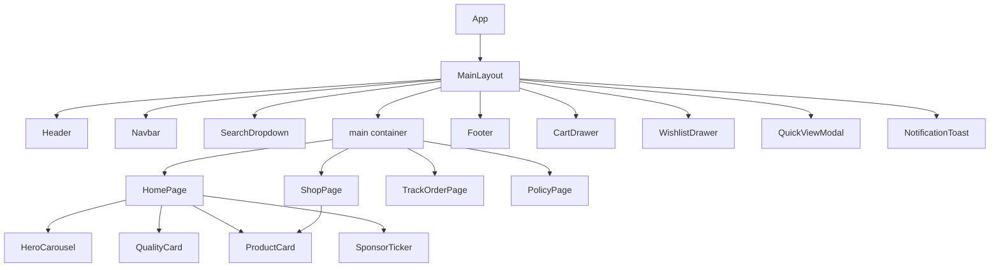

# Comprehensive AI Project Overview: FlyRank Internship Capstone

This document provides a complete, structural, and conceptual architectural blueprint of the **FlyRank Internship Capstone** project (branded in the UI as **Zenith E-Commerce**). It is engineered to give AI models, coding agents, and developers an exhaustive understanding of the codebase structure, design patterns, data models, state management contracts, component hierarchy, and extension guidelines.

---

## 1. Project Metadata & Technical Stack

- **Project Name:** `flyrank-internship-capstone` (Zenith E-Commerce Platform)
- **Framework:** React 19 + TypeScript + Vite 8
- **Styling Architecture:** Pure Vanilla CSS with CSS Custom Properties / Design Tokens (`src/styles/`)
- **Iconography:** `lucide-react`
- **Linting & Code Quality:** `oxlint`
- **Architectural Pattern:** Model-View-ViewModel (MVVM) adapted for React using Custom Hooks as ViewModels.
- **Routing:** Internal state-driven navigation orchestrated in `MainLayout.tsx` via `useThemeViewModel`.

---

## 2. Directory Structure & Architecture

```
FlyRank-internship-capstone/
├── package.json               # Dependencies & scripts (dev, build, lint, preview)
├── vite.config.ts             # Vite build configuration with React plugin
├── tsconfig.json              # TypeScript root configuration
├── .oxlintrc.json             # Oxlint rule configurations
├── index.html                 # HTML entry point with font preloads (Inter & Outfit)
└── src/
    ├── main.tsx               # Application bootstrap entry point
    ├── App.tsx                # Top-level React component rendering MainLayout
    ├── models/                # TypeScript Interfaces & Data Schemas
    │   ├── Product.ts         # Product, ProductCategory, ExclusiveDeal schemas
    │   ├── Cart.ts            # CartItem, CartSummary schemas
    │   ├── Order.ts           # OrderTrackingDetails, OrderStatusStep schemas
    │   ├── Policy.ts          # PolicySection, FAQItem schemas
    │   ├── Sponsor.ts         # Sponsor logo & link definitions
    │   └── mockData.ts        # Comprehensive mock dataset for products, deals, policies, & orders
    ├── viewmodels/            # Custom React Hooks encapsulating Business Logic (MVVM)
    │   ├── useThemeViewModel.ts        # Global navigation & search query state
    │   ├── useHomeViewModel.ts         # Hero carousel, deals, and sponsor data logic
    │   ├── useShopViewModel.ts         # Catalog filtering, search, sorting, & quick view logic
    │   ├── useCartViewModel.ts         # Cart CRUD, total/tax calculations, promo codes, checkout
    │   ├── useWishlistViewModel.ts     # Wishlist add/remove state management
    │   ├── useOrderTrackingViewModel.ts # Order search, step progress, & demo order logic
    │   └── usePolicyViewModel.ts       # Policy tab switching & content search filtering
    ├── views/                 # Presentation Layer (Pure React Components)
    │   ├── components/        # Reusable UI widgets & modal drawers
    │   │   ├── Header.tsx             # Global brand header with centered Zenith logo
    │   │   ├── Navbar.tsx             # Sticky navbar with search bar, drawer triggers, navigation
    │   │   ├── Footer.tsx             # Executive footer with navigation links & trust badges
    │   │   ├── HeroCarousel.tsx       # Auto-playing hero banner for exclusive deals
    │   │   ├── ProductCard.tsx        # Product card with badge, rating, wishlist, & quick view
    │   │   ├── QuickViewModal.tsx     # Modal drawer for detailed product view & gallery
    │   │   ├── CartDrawer.tsx         # Slide-out drawer with cart items, summary & checkout modal
    │   │   ├── WishlistDrawer.tsx     # Slide-out drawer for user wishlist items
    │   │   ├── SearchDropdown.tsx     # Dynamic quick search overlay in Navbar
    │   │   ├── QualityCard.tsx        # Feature benefit highlights (e.g. Free Shipping)
    │   │   ├── SponsorTicker.tsx      # Infinite sliding ticker for sponsor brand logos
    │   │   └── NotificationToast.tsx  # Toast feedback for user interactions
    │   ├── pages/             # Main Application Pages
    │   │   ├── HomePage.tsx           # Landing page with deal carousel, exclusive products, sponsors
    │   │   ├── ShopPage.tsx           # Full catalog page with sidebar filters, sorting, product grid
    │   │   ├── TrackOrderPage.tsx     # Order status lookup form & progress tracker visualization
    │   │   └── PolicyPage.tsx         # Tabbed policies reader with real-time text search
    │   └── layout/
    │       └── MainLayout.tsx         # Root layout binding all ViewModels to views & handling drawer state
    └── styles/                # CSS Design System
        ├── variables.css      # CSS variables (colors, typography, shadows, radii, transitions)
        ├── animations.css     # Keyframe animations (fade-in, slide-up, ticker scroll, glow pulse)
        └── main.css           # Global reset, component class styles, layout containers
```

---

## 3. Data Models & TypeScript Contracts (`src/models/`)

### `Product.ts`
```typescript
export type ProductCategory = 'all' | 'electronics' | 'laptops' | 'boots' | 'bluetooth' | 'hair-care' | 'sports';

export interface ProductRating {
  rate: number;
  count: number;
}

export interface Product {
  id: string;
  name: string;
  category: ProductCategory;
  categoryName: string;
  price: number;
  originalPrice: number;
  rating: ProductRating;
  image: string;
  gallery?: string[];
  description: string;
  specifications: Record<string, string>;
  isExclusive: boolean;
  inStock: boolean;
  brand: string;
  discountPercentage: number;
  badge?: string;
}

export interface ExclusiveDeal {
  id: string;
  productId: string;
  title: string;
  subtitle: string;
  bannerImage: string;
  discountBadge: string;
  originalPrice: number;
  dealPrice: number;
  timerHours: number;
  timerMinutes: number;
  timerSeconds: number;
  featureBullets: string[];
}
```

### `Cart.ts`
```typescript
export interface CartItem {
  product: Product;
  quantity: number;
  selectedColor?: string;
}

export interface CartSummary {
  subtotal: number;
  tax: number;
  shipping: number;
  discount: number;
  total: number;
  itemCount: number;
}
```

### `Order.ts`
```typescript
export type OrderStatusStep = 'confirmed' | 'processing' | 'shipped' | 'out_for_delivery' | 'delivered';

export interface OrderStatusEvent {
  step: OrderStatusStep;
  title: string;
  description: string;
  timestamp: string;
  completed: boolean;
  current: boolean;
}

export interface OrderItemDetail {
  productName: string;
  category: string;
  quantity: number;
  price: number;
  image: string;
}

export interface OrderTrackingDetails {
  orderId: string;
  customerName: string;
  email: string;
  orderDate: string;
  estimatedDelivery: string;
  carrier: string;
  trackingNumber: string;
  shippingAddress: string;
  status: OrderStatusStep;
  timeline: OrderStatusEvent[];
  items: OrderItemDetail[];
  totalAmount: number;
}
```

---

## 4. ViewModel State Management Architecture (`src/viewmodels/`)

The application avoids Redux/Zustand by creating dedicated React hooks that encapsulate business rules and export structured state and action handlers.

| ViewModel | Responsibility | Core State / Methods |
| :--- | :--- | :--- |
| `useThemeViewModel` | Controls app page routing and navbar search term state. | `activePage` ('home' \| 'shop' \| 'track-order' \| 'policy'), `searchQuery`, `navigateTo(page)` |
| `useHomeViewModel` | Controls hero deal carousel autoplay, timer decrement, deal swapping. | `currentDealIndex`, `isPlaying`, `nextDeal()`, `prevDeal()`, `deals`, `sponsors`, `exclusiveProducts` |
| `useShopViewModel` | Handles multi-criteria catalog search, category filtering, price sliders, sorting & product quick view modal state. | `selectedCategory`, `searchTerm`, `priceRange`, `minRating`, `sortBy`, `filteredProducts`, `quickViewProduct`, `clearFilters()` |
| `useCartViewModel` | Handles item adding/removing, quantity adjustments, coupon discounts (e.g. `ZENITH10`), calculation derived states, checkout modal lifecycle. | `cartItems`, `summary`, `addToCart()`, `updateQuantity()`, `removeFromCart()`, `applyPromoCode()`, `processCheckout()` |
| `useWishlistViewModel` | Toggles item inclusion in user wishlist. | `wishlistItems`, `wishlistCount`, `isInWishlist(id)`, `toggleWishlist(product)` |
| `useOrderTrackingViewModel` | Simulates API call delay for order tracking queries with error state and demo data filling. | `searchOrderId`, `emailInput`, `activeOrder`, `isLoading`, `errorMsg`, `handleSearch()`, `loadDemoOrder()` |
| `usePolicyViewModel` | Filters corporate policy articles by active tab or search query. | `activeTabId`, `searchTerm`, `filteredPolicies`, `activePolicy` |

---

## 5. UI Layout & View Hierarchy (`src/views/`)



---

## 6. Styling System & Design Tokens (`src/styles/`)

The design uses standard Vanilla CSS driven by CSS variables in `variables.css`.

- **Primary Colors:** Classic Executive Navy (`#001f3f`) for Navbar & Footer, Royal Blue (`#2563eb`) for brand accents, Slate (`#0f172a` / `#475569`) for typography.
- **Typography:** Headings use `Outfit` (sans-serif), body text uses `Inter` (sans-serif).
- **Glassmorphism & Elevation:** Uses standard `--bg-glass` (`rgba(255, 255, 255, 0.92)`), `--shadow-md`, and `--shadow-lg` for popups and drawers.

---

## 7. Guidelines for AI Code Modifications

When adding new features or refactoring existing code:
1. **Maintain MVVM Layer Separation:**
   - Put data contracts & type guards in `src/models/`.
   - Place business logic, calculation logic, or API fetching in `src/viewmodels/`.
   - Keep components in `src/views/` purely presentational, consuming values and callbacks passed from ViewModels.
2. **State Orchestration:**
   - Instantiate new ViewModels inside `src/views/layout/MainLayout.tsx` and pass needed values down via props.
3. **Styling Rules:**
   - Rely on CSS variables defined in `src/styles/variables.css`.
   - Avoid inline arbitrary styling where possible; add custom utility classes or keyframe animations in `main.css` or `animations.css`.
4. **Icons:**
   - Always import icons from `lucide-react`.
